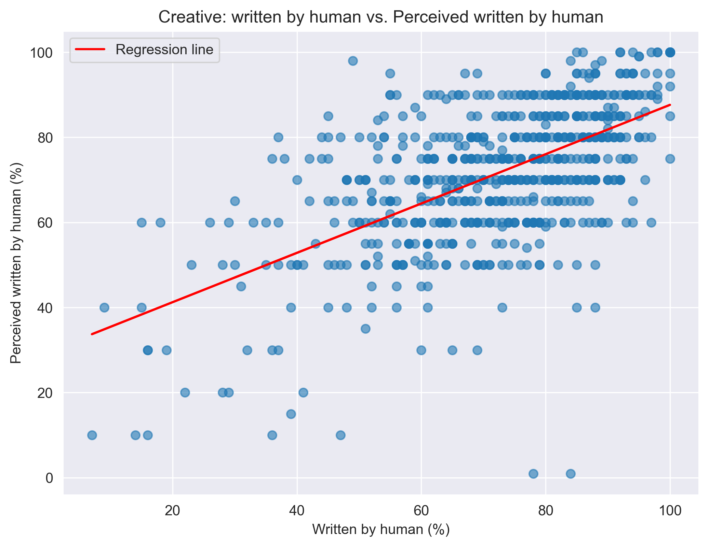

# CoAuthor: Response Times & Perceived Contributions Analysis  
**Understanding Human-AI Collaborative Writing**

## Project Overview  
This project analyzes human-AI collaborative writing using the **CoAuthor dataset**, which tracks keystroke-level interactions between writers and GPT-3. The focus is on:  
- **Response Times**: How do writers adapt to AI-generated suggestions over time?  
- **Perceived vs. Actual Contributions**: Do writers accurately assess how much they wrote versus how much AI contributed?  

## Key Findings  
### Response Times  
- Writers show a **learning curve**—response times **decrease** as the session progresses.  
- Early responses are **slower and more variable**, suggesting hesitation, while later responses stabilize, indicating **familiarity with AI suggestions**.  

### Perceived vs. Actual Contributions
- **Argumentative Writing**: Writers' perception aligns more closely with reality (**R² = 0.62**), meaning they have a better sense of their contributions.  
- **Creative Writing**: Writers are **less accurate** in assessing their contributions (**R² = 0.36**), likely due to the subjective nature of creativity.  
- In both cases, writers tend to **underestimate** their contributions (slopes <1), implying that AI’s role may feel larger than it actually is.  

## Visualizations  

### **Response Time Trends**  
This chart shows how writers' response times change over the course of a session, indicating a learning effect where writers become more efficient over time.  
  

### **Perceived vs. Actual Contributions (Creative Writing)**  
This scatter plot compares the actual percentage of the text written by humans with their perceived contributions in **creative writing**.  
  

### **Perceived vs. Actual Contributions (Argumentative Writing)**  
This scatter plot compares the actual and perceived contributions in **argumentative writing**, where writers' perceptions align more closely with reality than in creative writing.  
  

## COAUTHOR Dataset & Acknowledgments  

- This research is based on the **CoAuthor dataset**, a human-AI collaborative writing dataset that records keystroke-level interactions with GPT-3.  
- Learn more about the dataset here: [CoAuthor Project](https://coauthor.stanford.edu/).  
- This study was inspired by the original **CoAuthor paper**: [Read the paper](https://arxiv.org/abs/2201.06796).   
- Special thanks to Professor Mina Lee for guidance on this research.  

---
